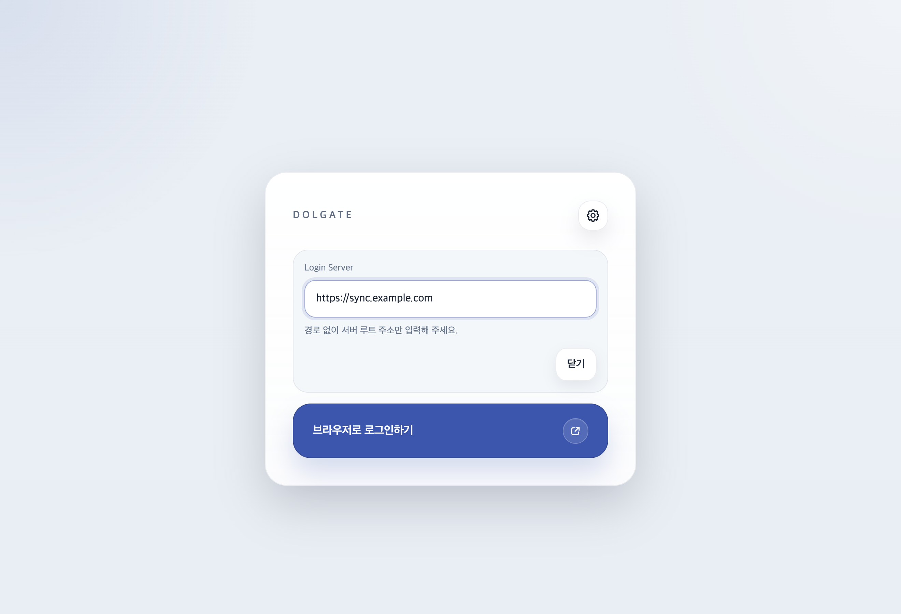

# Dolgate

Dolgate는 macOS와 Windows를 위한 크로스 플랫폼 SSH 클라이언트입니다.
멀티 세션 터미널, SFTP 파일 브라우저, 포트 포워딩, 세션 공유, 자체 호스팅 서버를 통한 동기화를 제공합니다.

## 핵심 기능

- 다중 SSH 세션과 분할 Workspace
- 듀얼 패널 SFTP 브라우저와 파일 전송
- Local / Remote / Dynamic 포트 포워딩
- 세션 녹화 및 재생
- Session Share, 브라우저 viewer, 실시간 채팅
- AWS EC2 import와 AWS SFTP, SSM 포트포워딩, ECS Exec shell, ECS 터널링
- Docker / Podman 컨테이너 모니터링, 로그, 메트릭, 셸, 터널링
- OpenSSH, Xshell, Termius import
- 자동 업데이트
- 셀프호스팅 서버

## 빠른 시작

### 다운로드

- 최신 macOS / Windows 빌드는 [GitHub Releases](https://github.com/doldolma/dolgate/releases)에서 받을 수 있습니다.

macOS 빌드는 Apple 공증이 포함되지 않았습니다.
앱을 `Applications`로 옮긴 뒤 실행이 막히면 아래 명령으로 quarantine 속성을 제거한 후 다시 실행해 주세요.

```bash
xattr -dr com.apple.quarantine /Applications/dolgate.app
```

또한 위의 문제로 인해 현재는 **macOS에서 자동 업데이트를 지원하지 않습니다.**
새 버전은 GitHub Releases에서 직접 다시 다운로드해 설치해야 합니다.

개발 환경 구성, 로컬 실행, 릴리즈 빌드는 [빌드 및 배포 문서](./docs/build-and-deploy.md)를 참고해 주세요.

## 중요한 사항

### AWS Import / AWS SSM 사용 전 확인

Dolgate의 AWS 기능은 로컬에 설치된 `aws` CLI와 `session-manager-plugin`을 사용합니다.
다음 기능들은 두 도구가 모두 PATH에서 실행 가능해야 정상 동작합니다.

- AWS EC2 Import
- AWS SSM shell 연결
- AWS SFTP
- AWS SSM 포트 포워딩
- AWS 기반 container tunnel

최소 확인:

```bash
aws --version
session-manager-plugin --version
```

macOS 예시:

```bash
brew install awscli
brew install --cask session-manager-plugin
```

추가로 AWS Import는 대상 인스턴스가 **SSM managed instance** 상태여야 하고, SSH username/port 자동 확인을 위해 SSM Run Command를 사용합니다.
현재 AWS Import는 **Linux/UNIX 계열 EC2 인스턴스 기준**으로 동작하며, Windows 인스턴스는 SSH import 대상으로 지원하지 않습니다.

### AWS 권한 예시

실제 운영에서는 리전, 인스턴스, 문서 이름 기준으로 더 좁히는 것을 권장하지만, 처음 붙일 때는 아래 정도 권한이 있으면 가장 덜 막힙니다.

```json
{
  "Version": "2012-10-17",
  "Statement": [
    {
      "Effect": "Allow",
      "Action": [
        "sts:GetCallerIdentity",
        "ec2:DescribeRegions",
        "ec2:DescribeInstances",
        "ssm:DescribeInstanceInformation",
        "ssm:StartSession",
        "ssm:TerminateSession",
        "ssm:SendCommand",
        "ssm:GetCommandInvocation"
      ],
      "Resource": "*"
    },
    {
      "Effect": "Allow",
      "Action": [
        "ec2-instance-connect:SendSSHPublicKey"
      ],
      "Resource": "*"
    }
  ]
}
```

권한 용도:

- `DescribeRegions`, `DescribeInstances`: AWS import에서 프로필/리전/인스턴스 목록 조회
- `DescribeInstanceInformation`: 인스턴스가 SSM managed 상태인지 확인
- `StartSession`, `TerminateSession`: AWS shell, SFTP, 포트 포워딩, container tunnel
- `SendCommand`, `GetCommandInvocation`: SSH username/port 자동 확인
- `ec2-instance-connect:SendSSHPublicKey`: AWS SFTP 및 SSH-over-SSM 계열 연결에서 임시 공개키 주입

### AWS ECS Exec 권한 참고

ECS Exec는 위의 일반 AWS/SSM 권한과 별도로 **ECS Exec용 권한**이 더 필요합니다.
Dolgate 앱에서 ECS `쉘 접속`을 쓰려면 최소한 아래 권한을 함께 확인해 주세요.

```json
{
  "Version": "2012-10-17",
  "Statement": [
    {
      "Effect": "Allow",
      "Action": [
        "ecs:ExecuteCommand",
        "ecs:DescribeTasks"
      ],
      "Resource": "*"
    }
  ]
}
```

추가 참고:

- ECS 서비스/태스크에 `enableExecuteCommand`가 켜져 있어야 합니다.
- task role에도 Session Manager 관련 `ssmmessages:*Channel` 권한이 필요할 수 있습니다.
- 컨테이너 이미지에 `/bin/sh`나 `bash` 같은 셸이 실제로 없으면, ECS Exec는 연결되더라도 interactive shell은 바로 종료될 수 있습니다.

### 그 외 알아두면 좋은 점

- Session Replay는 **로컬에만 저장**되며 서버 동기화 대상이 아닙니다.
- SSH / AWS / Warpgate host를 추가하면, 해당 호스트 아래의 **Docker 또는 Podman 컨테이너를 함께 모니터링**할 수 있습니다.
- Containers 기능과 container tunnel은 원격 호스트에 **Docker 또는 Podman**이 실제로 설치되어 있고, 로그인 셸에서 실행 가능해야 합니다.
- 브라우저 로그인/동기화를 직접 운영하려면 아래의 `sync-api`를 self-host 하거나, 앱 로그인 화면의 `Login Server`를 원하는 서버로 바꿔야 합니다.

## 자체 sync-api 호스팅

브라우저 로그인과 동기화를 직접 운영하려면 `sync-api`를 별도 서버에 띄우면 됩니다.
가장 단순한 방식은 Docker Compose로 `sync-api` 단일 컨테이너를 실행하는 것입니다.

```yaml
services:
  sync-api:
    image: ghcr.io/doldolma/dolgate-sync-api:latest
    container_name: dolgate-sync-api
    restart: unless-stopped
    ports:
      - "8080:8080"
    volumes:
      - dolgate-sync-api-data:/app/data

volumes:
  dolgate-sync-api-data:
```

실행:

```bash
docker compose up -d
curl http://127.0.0.1:8080/healthz
```

운영에서는 `latest` 대신 버전 태그 고정을 권장합니다.
```yaml
image: ghcr.io/doldolma/dolgate-sync-api:1.1.11
```

데스크톱 앱에서는 로그인 화면의 톱니바퀴를 눌러 `Login Server`를 self-host 주소로 바꾸면 됩니다.



## 문서

- [기능 흐름](./docs/feature-flows.md)
- [아키텍처](./docs/architecture.md)
- [빌드 및 배포](./docs/build-and-deploy.md)
- [ssh-core IPC 프로토콜](./docs/ipc-protocol.md)
