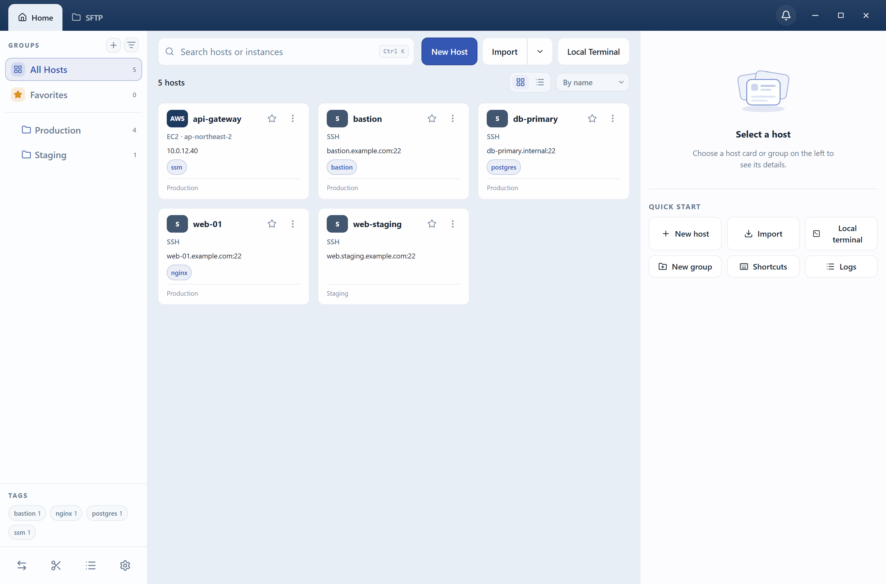
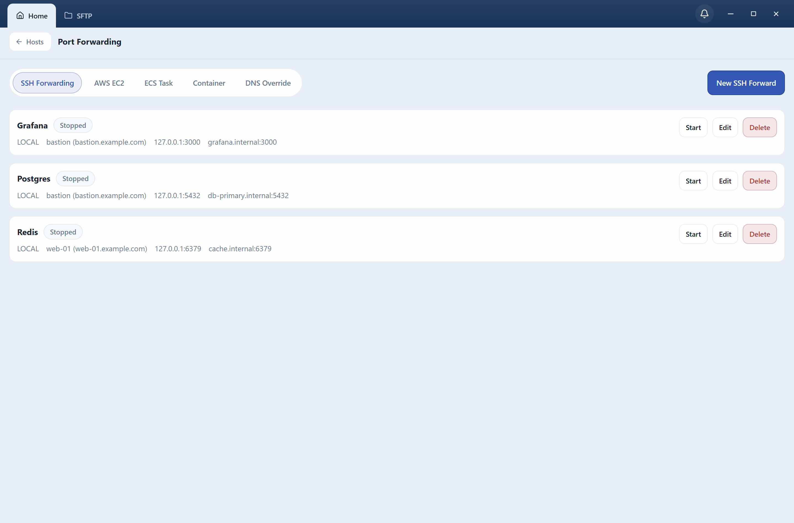

# Dolgate

**English** | [한국어](./README.ko.md)

Dolgate is an SSH workspace that carries the same server working environment across Windows, macOS, Linux, iOS and Android.
Hosts, sessions and snippets sync between devices — and you can self-host `sync-api` so your connection details and working data stay under your own control.

Two things set it apart from other SSH clients: **it joins a Tailscale tailnet without installing Tailscale**, and **it talks to AWS SSM without the AWS CLI or session-manager-plugin**.

<picture>
  <source media="(prefers-color-scheme: dark)" srcset="./docs/images/hosts-workspace-dark.png">
  
</picture>

### Highlights

- **SSH workspace** — multi-session terminals, SFTP and port forwarding in one app. SSH Agent authentication, Agent Forwarding and jump hosts (bastions) are supported.
- **AWS SSM integration** — reach EC2 instances that have no public IP and no inbound ports, without installing the AWS CLI or session-manager-plugin. Supports SSH-over-SSM, SSM shell fallback, AWS SFTP, SSM port forwarding and ECS Exec.
- **Tailscale built in** — the app itself becomes a tailnet node without installing Tailscale, and it never touches your OS network settings. Join several tailnets at once and move between them in one window, even when they are separate networks.
- **Command blocks** — every command you run shows its exit status and duration. Copy just the output, re-run it, or jump between failed commands.
- **tmux control mode** — remote tmux windows become app tabs and panes become splits, and you can reattach to detached sessions.
- **AI assistant** — open it with `Cmd/Ctrl+I` to ask questions grounded in the current SSH session's host details and recent terminal output, with approved tools for inspecting and running things.
- **Session recording and replay** — finished terminal sessions are stored locally only, and replayable on a timeline.
- **Self-hosted sync & end-to-end encryption** — run your own `sync-api` to sync hosts, sessions and snippets between desktop and mobile. Data is encrypted on the device before upload and the decryption key is protected by your sync passphrase, so the server only ever holds ciphertext (zero-knowledge).
- **Session sharing & collaboration** — share a running session as a browser viewer link and watch it together with live chat.

## Components

- **Desktop** — Windows · macOS · Linux (Electron). The main app: multi-session terminals, SFTP, port forwarding, session sharing, AWS and container work.
- **Mobile** — iOS · Android (React Native). Focused on reaching remote sessions through synced hosts/groups and a session tab workspace.
- **sync-api** — the server behind browser login, the sync store, the session share viewer and the AWS SSM broker. You can run it yourself (see [self-hosting](#self-hosting-sync-api) below).

The whole repository is released together under a single `vX.Y.Z` version.

## Quick start

### Download

Grab the installer for your OS from the [**download page**](https://doldolma.github.io/Dolgate/#download) — Windows (exe), macOS (dmg), Linux (deb/rpm), Android (APK). iOS is on the App Store.

Linux `deb` and ARM64 builds are on [GitHub Releases](https://github.com/doldolma/dolgate/releases).

The desktop app supports auto-update. Once installed, new versions can be applied from inside the app.

For development setup, running locally and release builds, see the [build and deployment guide](./docs/build-and-deploy.md).

## All features

**Terminal & sessions**

- Multiple SSH sessions with a split, tab-based workspace
- tmux control mode — windows become tabs, panes become splits, operable without tmux keybindings, detach supported
- mosh connections — UDP connections that survive network changes and sleep/wake (requires `mosh-server` on the remote; shell integration features are disabled)
- Command autocomplete — Fig specs, dynamic values from remote generators, file and folder paths, and snippets
- Command snippets — with `{{variable}}` substitution
- Session recording and replay — stored locally, never synced to the server
- OS notification on command completion — for long-running or failed commands (threshold and conditions configurable)
- Command blocks — per-command status via shell integration, hover actions (copy output/command, re-run, AI) and a command palette (`Cmd/Ctrl+Shift+P`)

**AI assistant**

- Right-side AI panel — open with the AI button or `Cmd/Ctrl+I`; uses the current session's host details and the last 100 lines of terminal output as context
- Providers — OpenAI-compatible APIs (OpenAI, Ollama, LM Studio, vLLM and others), Anthropic Claude API, Codex (ChatGPT account login)
- Tools — web search and URL reading, hidden SSH exec for inspection, running commands in the visible terminal, reading terminal scrollback from before the question
- Safeguards — secret redaction, approval for mutating commands, and a stop button

**File transfer**

- Dual-pane SFTP browser
- Terminal file transfer — drag a local file to upload over SFTP, or run `sz` on the remote for automatic ZMODEM download
- Built-in editing of remote files over SFTP — open, edit and save in the app (with change-conflict detection, and sudo save for root-owned files)

**Connectivity & networking**

- SSH Agent authentication — connect with keys held by the local `ssh-agent`, 1Password, or added via `ssh-add`
- SSH Agent Forwarding — forward local keys to a remote hop on hosts you trust
- Jump host (bastion) connections — designate a saved SSH host as a ProxyJump
- Local / Remote / Dynamic port forwarding
- Tailscale built in — the app joins a tailnet as a node without the Tailscale client installed
- No effect on OS networking — everything runs in the app's own network stack. No system routing or DNS changes, and no administrator privileges
- Multiple tailnets at once — register separate tailnets together and pick which one each host goes through

**AWS & containers**

- AWS EC2 import, EC2 SSH-over-SSM, SSM shell fallback, AWS SFTP, SSM port forwarding, ECS Exec shell, ECS tunneling
- Built-in SSM data channel — no AWS CLI or session-manager-plugin required
- Docker / Podman container monitoring, logs, metrics, shell and tunneling

**Sharing, export & import**

- Session Share, browser viewer, live chat
- Host export — a password-encrypted Dolgate file (`.dolgate`), or OpenSSH config
- Import from OpenSSH / Xshell / Termius, and from Dolgate files

**Sync & security**

- Passkey (WebAuthn) login — sign in without a password using biometrics or a security key (when enabled on the server)
- End-to-end encryption (E2EE) — hosts, credentials, snippets and the rest are encrypted on the device, so the server stores only ciphertext
- Zero-knowledge — the encryption key is wrapped with your sync passphrase (Argon2id) and the server never holds the key itself. If you forget the passphrase, not even the server can recover it

See the [data protection document](./docs/data-protection.md) for the design in detail.

**Other**

- Auto-update · self-hosted sync-api

<picture>
  <source media="(prefers-color-scheme: dark)" srcset="./docs/images/port-forwarding-dark.png">
  
</picture>

## Self-hosting sync-api

To run browser login and sync yourself, host `sync-api` on your own server.
It is a single container, so one `docker run` is enough to start.

```bash
docker run -d --name dolgate-sync-api \
  -p 8080:8080 -v dolgate-sync-api-data:/app/data \
  ghcr.io/doldolma/dolgate-sync-api

curl http://127.0.0.1:8080/healthz
```

In production, pin a version tag (`ghcr.io/doldolma/dolgate-sync-api:X.Y.Z`) rather than
using `latest`. For Docker Compose setups, reverse proxies, MySQL and other operational
details, see the [sync-api self-hosting guide](./docs/sync-api-self-hosting.md).

In the desktop app, click the gear on the login screen and point `Login Server` at your self-hosted address.

<picture>
  <source media="(prefers-color-scheme: dark)" srcset="./docs/images/login-dark.png">
  
</picture>

## Things to know

### Before using AWS / SSM

EC2 terminals try SSH-over-SSM first. If a normal SSH connection cannot be opened during public key injection or SSH preparation, it can fall back to an SSM shell; AWS SFTP, SSM port forwarding and ECS Exec/tunneling all run over the built-in SSM data channel. Profile authentication (SSO browser login, credential validation, AssumeRole) is handled by the AWS SDK, and existing local `~/.aws` profiles can be imported and used as they are.

The target EC2 instance must be an **SSM managed instance**, and AWS Import is built around Linux/UNIX instances.
SSH-over-SSM and AWS SFTP require EC2 Instance Connect public key injection permissions. For the IAM permissions involved (user/role · EC2 instance profile · ECS task role) and example policy JSON, see the [AWS / SSM setup guide](./docs/aws.md).

### Other

- Session Replay is **stored locally only** and is never synced to the server.
- When you add an SSH / AWS / Warpgate host, you can also **monitor the Docker or Podman containers** running on it.
- The Containers feature and container tunnels require **Docker or Podman** to actually be installed on the remote host and runnable from a login shell.
- To run browser login and sync yourself, self-host `sync-api` as above and point `Login Server` in the app's login screen at your server.

## Documentation

- [Desktop](./docs/desktop.md)
- [Tailscale / Headscale guide](./docs/tailscale.md)
- [AI assistant](./docs/ai-assistant-design.md)
- [AWS / SSM setup guide](./docs/aws.md)
- [Architecture](./docs/architecture.md)
- [Data protection (E2EE)](./docs/data-protection.md)
- [Build and deployment](./docs/build-and-deploy.md)
- [sync-api self-hosting guide](./docs/sync-api-self-hosting.md)
- [ssh-core IPC protocol](./docs/ipc-protocol.md)

## License

MIT © 2026 doldolma

The command autocomplete generator runtime and bundled specs are derived from Amazon Q Developer CLI (Apache-2.0/MIT) and withfig/autocomplete (MIT); those components remain under their own licenses.
