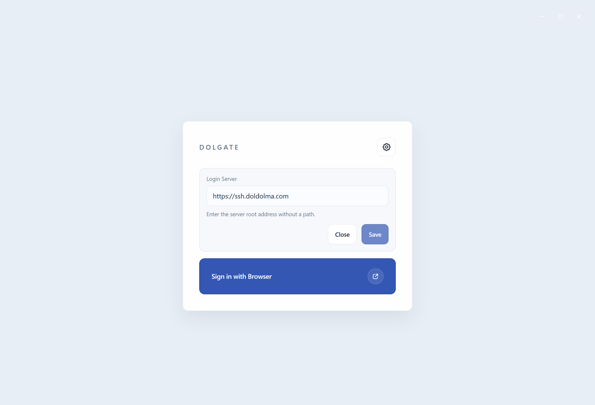

# Dolgate

Dolgate는 호스트·세션·스니펫을 데스크톱과 모바일이 동기화하며 쓰는 SSH 작업 환경입니다.
AWS SSM으로 EC2·ECS에 SSH 포트 없이 접속하고, 동기화 백엔드까지 직접 호스팅할 수 있으며, 실행 중인 세션은 브라우저 링크 하나로 공유할 수 있습니다.


### 대표 기능

- **AWS SSM 네이티브 통합** — EC2 import, SSM 기반 shell·SFTP·포트 포워딩, ECS Exec 셸·터널링까지. 인스턴스에 SSH 인바운드 포트를 열지 않고, 앱에 내장된 SSM 데이터 채널로 접속합니다.
- **동기화를 self-host로** — 호스트·세션·스니펫을 데스크톱↔모바일로 동기화하는 `sync-api`를 직접 띄울 수 있습니다. 로그인·데이터를 외부 클라우드에 맡기지 않고 자체 서버에서 운영할 수 있습니다.
- **원격 값까지 읽는 명령어 자동완성** — Fig 스펙 옵션·서브커맨드에 더해, 원격 호스트에서 직접 값을 가져오는 동적 추천(컨테이너 이름·git 브랜치 등)과 경로·스니펫까지 추천합니다.
- **세션 공유 & 협업** — 실행 중인 세션을 브라우저 viewer 링크로 공유하고 실시간 채팅으로 함께 봅니다.

## 구성

- **Desktop** — macOS · Windows (Electron). 멀티 세션 터미널, SFTP, 포트 포워딩, 세션 공유, AWS/컨테이너 작업을 다루는 메인 앱입니다.
- **Mobile** — iOS · Android (React Native). 동기화된 호스트/그룹과 세션 탭 워크스페이스를 중심으로 원격 세션에 접근합니다.
- **sync-api** — 브라우저 로그인, 동기화 저장소, session share viewer, AWS SSM 브로커를 담당하는 서버입니다. 직접 띄울 수 있습니다(아래 [자체 호스팅](#자체-sync-api-호스팅) 참고).

저장소 전체는 하나의 `vX.Y.Z` 버전으로 함께 릴리즈됩니다.

## 기능 전체

**터미널 & 세션**

- 다중 SSH 세션과 분할 워크스페이스(탭 기반)
- tmux control mode — 윈도우→탭, 패인→분할로 보여주고 단축키 없이 조작, detach 지원
- mosh 연결 (옵션) — UDP 기반이라 네트워크 전환·절전/복귀엔 강하지만, 셸 통합(자동완성·명령 완료 알림)은 비활성화됩니다 (원격 `mosh-server` 필요)
- 명령어 자동완성 — Fig 스펙 + 원격 generator 동적 값 + 파일/폴더 경로 + 스니펫
- 명령어 스니펫 — `{{변수}}` 치환 지원
- 세션 녹화 및 재생
- 명령 완료 OS 알림 — 오래 걸리거나 실패한 명령 종료 시 (셸 통합 기반; 기준 시간·실패 시·비활성 시 옵션)

**파일 전송**

- 듀얼 패널 SFTP 브라우저
- 터미널 파일 전송 — 로컬 드래그 → SFTP 업로드 / 원격 `sz` → ZMODEM 다운로드 자동 수신
- SFTP 원격 파일 내장 편집 — 앱에서 바로 열어 수정·저장(변경 충돌 감지, root 소유 파일은 sudo 저장)

**연결 & 네트워크**

- 점프 호스트(베스천) 경유 연결 — 저장된 SSH 호스트를 ProxyJump로 지정
- Local / Remote / Dynamic 포트 포워딩

**AWS & 컨테이너**

- AWS EC2 import, AWS SFTP, SSM 포트 포워딩, ECS Exec shell, ECS 터널링
- Docker / Podman 컨테이너 모니터링·로그·메트릭·셸·터널링

**공유 & 가져오기**

- Session Share, 브라우저 viewer, 실시간 채팅
- OpenSSH / Xshell / Termius import

**그 외**

- 자동 업데이트 · 셀프호스팅 sync-api


## 빠른 시작

### 다운로드

- 최신 데스크톱 빌드와 Android APK는 [GitHub Releases](https://github.com/doldolma/dolgate/releases)에서 받을 수 있습니다.
- iOS는 현재 개발/내부 빌드 중심으로 관리합니다.

macOS 빌드는 Apple 공증이 포함되지 않았습니다.
앱을 `Applications`로 옮긴 뒤 실행이 막히면 아래 명령으로 quarantine 속성을 제거한 후 다시 실행해 주세요.

```bash
xattr -dr com.apple.quarantine /Applications/dolgate.app
```

또한 위의 문제로 인해 현재는 **macOS에서 자동 업데이트를 지원하지 않습니다.**
새 버전은 GitHub Releases에서 직접 다시 다운로드해 설치해야 합니다.

개발 환경 구성, 로컬 실행, 릴리즈 빌드는 [빌드 및 배포 문서](./docs/build-and-deploy.md)를 참고해 주세요.

### 로컬 개발 진입점

```bash
npm run dev:desktop
npm run dev:mobile:ios
npm run dev:mobile:android
npm run dev:api
```

## 자체 sync-api 호스팅

브라우저 로그인과 동기화를 직접 운영하려면 `sync-api`를 별도 서버에 띄우면 됩니다.
가장 단순한 시작점은 Docker Compose로 `sync-api` 단일 컨테이너를 실행하는 것입니다.

상세 설정과 운영 가이드는 [sync-api 자체 호스팅 가이드](./docs/sync-api-self-hosting.md)를 참고해 주세요.

```yaml
services:
  sync-api:
    image: ghcr.io/doldolma/dolgate-sync-api:latest
    container_name: dolgate-sync-api
    restart: unless-stopped
    ports:
      - "8080:8080"
    volumes:
      - dolgate-sync-api-data:/app/data

volumes:
  dolgate-sync-api-data:
```

실행:

```bash
docker compose up -d
curl http://127.0.0.1:8080/healthz
```

운영에서는 `latest` 대신 버전 태그 고정을 권장합니다.

```yaml
image: ghcr.io/doldolma/dolgate-sync-api:X.Y.Z
```

데스크톱 앱에서는 로그인 화면의 톱니바퀴를 눌러 `Login Server`를 self-host 주소로 바꾸면 됩니다.


## 중요한 사항

### AWS / SSM 사용 전 확인

세션(SSM shell · AWS SFTP · SSM 포트 포워딩 · ECS Exec/터널링)은 내장 SSM 데이터 채널로, 프로필 인증(SSO 브라우저 로그인, 자격 증명 검증, AssumeRole)은 AWS SDK로 동작합니다. 기존 로컬 `~/.aws` 프로필은 가져오기로 그대로 사용할 수 있습니다.

대상 EC2는 **SSM managed instance** 상태여야 하고, AWS Import는 Linux/UNIX 인스턴스를 기준으로 동작합니다.
필요한 IAM 권한(사용자/역할 · EC2 인스턴스 프로파일 · ECS task role)과 정책 JSON 예시는 [AWS / SSM 설정 가이드](./docs/aws.md)를 참고하세요.

### 그 외

- Session Replay는 **로컬에만 저장**되며 서버 동기화 대상이 아닙니다.
- SSH / AWS / Warpgate host를 추가하면, 해당 호스트 아래의 **Docker 또는 Podman 컨테이너를 함께 모니터링**할 수 있습니다.
- Containers 기능과 container tunnel은 원격 호스트에 **Docker 또는 Podman**이 실제로 설치되어 있고, 로그인 셸에서 실행 가능해야 합니다.
- 브라우저 로그인/동기화를 직접 운영하려면 위의 `sync-api`를 self-host 하고 앱 로그인 화면의 `Login Server`를 원하는 서버로 바꿔야 합니다.

## 문서

- [Desktop 문서](./docs/desktop.md)
- [Mobile 문서](./docs/mobile.md)
- [AWS / SSM 설정 가이드](./docs/aws.md)
- [기능 흐름](./docs/feature-flows.md)
- [아키텍처](./docs/architecture.md)
- [빌드 및 배포](./docs/build-and-deploy.md)
- [sync-api 자체 호스팅 가이드](./docs/sync-api-self-hosting.md)
- [ssh-core IPC 프로토콜](./docs/ipc-protocol.md)

## 라이선스

MIT © 2026 doldolma

명령어 자동완성의 generator 런타임과 번들 스펙은 Amazon Q Developer CLI(Apache-2.0/MIT)와 withfig/autocomplete(MIT)에서 가져왔으며, 해당 구성요소는 각자의 라이선스를 따릅니다.
