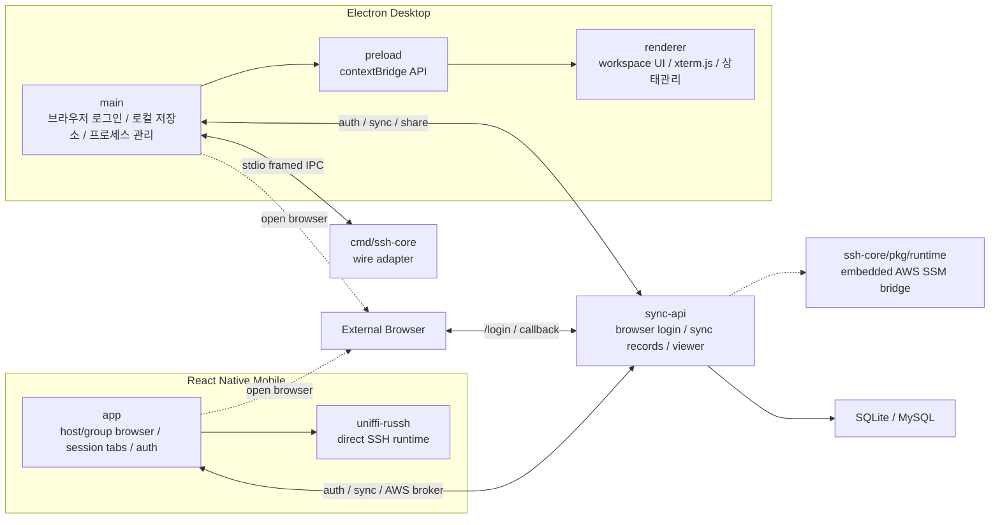

# Dolgate 아키텍처

Dolgate는 현재 네 개의 주요 런타임 경계로 나뉩니다.

1. Electron 기반 데스크톱 앱
2. React Native 기반 모바일 앱
3. SSH/SFTP/포트 포워딩 기능을 제공하는 Go `ssh-core`
4. 인증, 동기화, session share viewer, AWS SSM 브로커를 담당하는 Go `sync-api`

복잡한 사용자 흐름은 [feature-flows](./feature-flows.md) 문서를 함께 참고하는 편이 좋습니다.

## 데스크톱 앱

- `main`
  브라우저 윈도우, 로컬 파일 저장소, encrypted secret store, 브라우저 로그인, 서버 동기화, Go 코어 프로세스 수명주기, GitHub Releases 기반 auto update를 관리합니다.
- `preload`
  `contextBridge`를 통해 renderer에 필요한 최소 API만 노출합니다.
- `renderer`
  Zustand 상태와 xterm.js 기반 탭 UI, 로그인 게이트, 호스트 목록, 검색 인터페이스, 고정 `SFTP` 워크스페이스를 담당합니다.

주요 런타임 특징:

- 앱 시작 시 먼저 refresh token으로 로그인 복구를 시도합니다.
- 온라인 복구가 실패해도 offline lease가 유효하면 `offline-authenticated` 상태로 홈 화면을 열고, 이후 백그라운드에서 재동기화를 재시도합니다.
- 새 로그인은 backend `/login` 페이지를 외부 브라우저로 열고, 성공 시 로컬 loopback callback 또는 `dolgate://auth/callback` 식별자를 통해 세션을 교환합니다.
- `ssh-core`는 앱 시작 시 항상 떠 있지 않고, 실제 SSH/SFTP/포트 포워딩 경로가 필요할 때 lazily 시작합니다.
- 로컬 파일 브라우징은 Electron main의 파일 서비스가 담당하고, 원격 SFTP 작업과 파일 전송은 Go 코어가 담당합니다.

## 모바일 앱

- React Native 기반 iOS / Android 앱입니다.
- 동기화된 host / group / session 상태를 기반으로 현재 연결된 세션 탭 워크스페이스를 구성합니다.
- SSH 세션은 모바일 런타임에서 직접 처리하고, 인증/동기화/AWS SSM 브로커 경로는 `sync-api`와 통신합니다.
- 모바일은 데스크톱과 같은 저장소 버전을 따르지만, 별도 앱 런타임과 별도 build 체계를 가집니다.

## SSH 코어

- `services/ssh-core/pkg/runtime`이 공개 런타임 façade 역할을 합니다.
- 내부 구현은 여전히 `internal/awssession`, `internal/sshsession`, `internal/sftp`, `internal/containers`, `internal/forwarding`, `internal/ssmforward` 같은 세부 서비스에 남아 있습니다.
- Electron 데스크톱은 여전히 `cmd/ssh-core` child process를 띄워 사용합니다.
- `cmd/ssh-core`는 stdio framed protocol을 decode/encode하는 호환 어댑터이고, 실제 작업은 `pkg/runtime`에 위임합니다.
- `sync-api`는 AWS SSM WebSocket 브로커에서 `pkg/runtime`를 직접 import해서 고루틴 기반으로 세션을 처리합니다.
- control 명령은 metadata JSON frame으로, 터미널 입출력은 raw byte stream frame으로 주고받습니다.
- SSH 터미널 세션은 `sessionId`, SFTP endpoint는 `endpointId`, 전송 작업은 `jobId`로 구분합니다.
- 개발 모드에서 desktop는 `go run ./cmd/ssh-core`를 필요 시 실행하고, 서버는 `sync-api` 프로세스 안에 embedded runtime을 직접 구성합니다.

## Sync API

- 서버는 `/login` 브라우저 페이지와 인증 API, 그리고 암호화된 동기화 레코드 저장소를 함께 제공합니다.
- 인증은 local login + optional OIDC SSO를 동시에 지원할 수 있습니다.
- refresh token은 해시만 저장하며, 미사용 14일 만료와 rotation 정책을 사용합니다.
- 동기화 레코드는 `groups`, `hosts`, `secrets`, `known_hosts`, `port_forwards`, `preferences` 단위의 generic `sync_records` 구조에 저장합니다.
- secrets는 비밀번호, passphrase, 관리형 private key PEM까지 포함하지만 서버에는 ciphertext만 저장합니다.
- session share는 별도의 in-memory hub와 viewer asset으로 제공되며, 브라우저 viewer는 WebSocket으로 owner 세션을 구독합니다.
- 저장소 계층은 GORM으로 구현하고, SQLite와 MySQL을 모두 지원합니다.
- 모바일 AWS SSM 세션 브로커는 `sync-api` 안의 embedded `ssh-core/pkg/runtime`를 사용하며, 별도 `ssh-core` 바이너리를 실행하지 않습니다.

## 경계 요약

- 데스크톱은 `cmd/ssh-core` child process를 사용합니다.
- 모바일은 자체 모바일 런타임으로 SSH 세션을 처리하고, 서버와는 인증/동기화/AWS 경계에서 통신합니다.
- `sync-api`는 브라우저 로그인, 암호화된 동기화 저장소, session share, AWS SSM 브로커를 한 프로세스에서 담당합니다.
- `ssh-core/pkg/runtime`는 desktop과 server 양쪽에서 재사용되는 공용 코어 런타임입니다.
