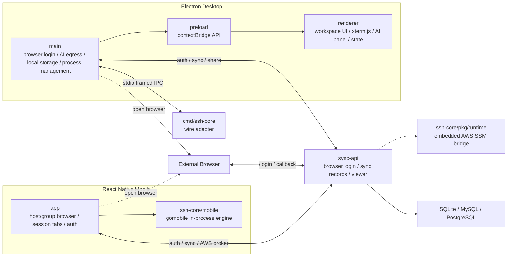
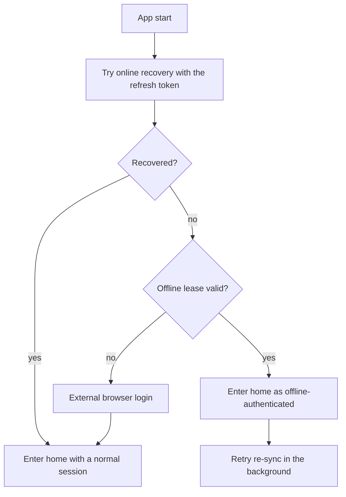

# Dolgate Architecture

Dolgate currently divides into four major runtime boundaries.

1. The Electron-based desktop app
2. The React Native-based mobile app
3. Go `ssh-core`, providing SSH/SFTP/port forwarding
4. Go `sync-api`, handling authentication, sync, the session share viewer, and the AWS SSM broker

Complex user flows (auth/offline, Session Share, AWS import, host export/import, Warpgate) are summarized under [Key flows](#key-flows) below.

```mermaid
flowchart LR
  subgraph Desktop["Electron Desktop"]
    Main["main<br/>browser login / AI egress / local storage / process management"]
    Preload["preload<br/>contextBridge API"]
    Renderer["renderer<br/>workspace UI / xterm.js / AI panel / state"]
    Main --> Preload --> Renderer
  end
  subgraph Mobile["React Native Mobile"]
    MobileApp["app<br/>host/group browser / session tabs / auth"]
    MobileSSH["ssh-core/mobile<br/>gomobile in-process engine"]
    MobileApp --> MobileSSH
  end
  Main <-->|"stdio framed IPC"| CoreCmd["cmd/ssh-core<br/>wire adapter"]
  Main <-->|"auth / sync / share"| Sync["sync-api<br/>browser login / sync records / viewer"]
  MobileApp <-->|"auth / sync / AWS broker"| Sync
  Sync -.-> CoreLib["ssh-core/pkg/runtime<br/>embedded AWS SSM bridge"]
  Sync --> DB["SQLite / MySQL / PostgreSQL"]
  Browser["External Browser"] <-->|"/login / callback"| Sync
  Main -. "open browser" .-> Browser
  MobileApp -. "open browser" .-> Browser
```

## Desktop app

- `main`
  Manages browser windows, local file storage, the encrypted secret store, browser login, server sync, AI provider egress, the Go core process lifecycle, and GitHub Releases-based auto-update.
- `preload`
  Exposes only the minimum API the renderer needs, via `contextBridge`.
- `renderer`
  Owns Zustand state and the xterm.js tab UI, the login gate, the host list, search interfaces, the pinned `SFTP` workspace, the AI panel, and terminal scrollback snapshots.

Key runtime traits:

- main handles login recovery at app start, `offline-authenticated` entry based on the offline lease, and session exchange for external browser login (detailed steps under [Key flows > Auth and offline](#auth-and-offline)).
- The AI assistant's provider calls and web/URL tools run in Electron main, keeping API keys and external egress out of the renderer. The renderer owns only the terminal snapshot taken at question time and the user interface.
- `ssh-core` is not kept running from app start; it starts lazily when an actual SSH/SFTP/port forwarding path needs it.
- Local file browsing is served by Electron main's file service; remote SFTP operations, file transfers, and in-app file editing (read/write) are the Go core's job.

## Mobile app

- A React Native app for iOS / Android.
- Builds the currently connected session tab workspace on top of synced host / group / session state.
- A bottom shortcut bar and mobile terminal input helpers assist terminal input in a touch environment.
- SSH/SFTP is handled directly by an engine bound into the app process from `ssh-core`; auth, sync, and the AWS SSM broker talk to `sync-api`.
- It cannot spawn subprocesses, and pushing terminal output chunk-by-chunk over the React Native bridge is costly — so output accumulates in a ring buffer that the app reads with a cursor.
- Mobile follows the same repository version as desktop but has its own app runtime and build system (for builds and runs, see [build-and-deploy](./build-and-deploy.md)).

## SSH core

- `services/ssh-core/pkg/runtime` acts as the public runtime façade.
- Below it, services split by connection type — plain SSH/PTY, mosh (bootstrapped over SSH then switched to UDP), tmux control mode (remote windows/panes mapped to tabs/splits), SFTP, port forwarding, AWS SSM, and containers.
- The Electron desktop runs it as a `cmd/ssh-core` child process.
- `cmd/ssh-core` is a compatibility adapter that decodes/encodes the stdio framed protocol; the actual work is delegated to `pkg/runtime`.
- `sync-api` imports `pkg/runtime` directly in its AWS SSM WebSocket broker, handling sessions in goroutines.
- Mobile uses a separate gomobile-bound surface inside the app process instead of `pkg/runtime`.
- All three paths share the same connection layer for dialing, jump chains, host key policy, and authentication.
- Control commands travel as metadata JSON frames; terminal I/O travels as raw byte stream frames.
- SSH terminal sessions are identified by `sessionId`, SFTP endpoints by `endpointId`, and transfer jobs by `jobId`.
- In development, desktop runs `go run ./cmd/ssh-core` on demand, and the server composes the embedded runtime directly inside the `sync-api` process.

## Sync API

- The server provides the `/login` browser page and auth APIs together with the encrypted sync record store.
- Authentication can support local login and optional OIDC SSO simultaneously.
- Refresh tokens are stored as hashes only, with a 14-day idle expiry and a rotation policy.
- Sync records are stored in a generic `sync_records` structure with `groups`, `hosts`, `secrets`, `known_hosts`, `port_forwards`, and `preferences` units.
- Secrets include passwords, passphrases, and managed private key PEMs — but the server stores ciphertext only.
- Session share is served by a separate in-memory hub with viewer assets; the browser viewer subscribes to the owner session over WebSocket.
- The storage layer is implemented with GORM, supporting SQLite, MySQL, and PostgreSQL.
- The mobile AWS SSM session broker uses the embedded `ssh-core/pkg/runtime` inside `sync-api`; no separate `ssh-core` binary is executed.

## Boundary summary

- Desktop uses the `cmd/ssh-core` child process.
- Mobile binds `ssh-core/mobile` via gomobile to handle SSH inside the app process, talking to the server only at the auth/sync/AWS boundaries.
- `sync-api` covers browser login, the encrypted sync store, session share, and the AWS SSM broker in one process.
- `ssh-core/pkg/runtime` is the shared core runtime reused by both desktop and server. Mobile uses the `mobile` package instead of this façade, but the connection layer `internal/sshconn` is shared by all three.

## Key flows

Quick summaries for understanding the complex user flows.

### Auth and offline

```mermaid
flowchart TD
  Start["App start"] --> Refresh["Try online recovery with the refresh token"]
  Refresh --> Online{"Recovered?"}
  Online -->|yes| Ready["Enter home with a normal session"]
  Online -->|no| Lease{"Offline lease valid?"}
  Lease -->|yes| Offline["Enter home as offline-authenticated"]
  Offline --> Resync["Retry re-sync in the background"]
  Lease -->|no| Browser["External browser login"]
  Browser --> Ready
```

- While offline, the existing local cache and settings are used, and re-sync retries in the background.
- Login happens in an external browser; desktop exchanges the session via a loopback callback or the `dolgate://auth/callback` identifier.

### Session Share

#### owner

- Starting a share from a terminal session generates a viewer URL.
- The owner can switch between read-only and input-allowed modes.
- When a viewer sends a chat message, toasts stack at the bottom right of the owner's desktop.
- The `chat history` button opens a separate window showing recent messages live.

#### viewer

- The browser viewer connects via the session share URL.
- It combines the terminal screen with a chat panel.
- The chat panel starts collapsed; opening it enables live chat between participants.
- When the session ends, viewer connections and chat history are cleaned up together.

### AWS import + AWS SFTP

#### import

- Picking an AWS profile checks its authentication state.
- If the profile has a default region, it is auto-selected and the EC2 list loads.
- Without a default region, only the region list is shown first; EC2 is queried only after the user picks one.
- For Linux instances, `Check SSH info` fetches suggested SSH username/port values.
- Auto-detected values are editable, and a Host can be registered even with the fields left empty.

#### SFTP

- AWS SFTP supports Linux instances only.
- Prerequisites:
  - SSM managed
  - sshd/SFTP enabled
  - EC2 Instance Connect available
  - AWS profile authenticated (session connections run over the built-in SSM data channel)
- Connection progress is shown step by step in the UI:
  - profile check
  - browser login if needed
  - SSM check
  - instance metadata check
  - host key probe
  - ephemeral key generation and public key delivery
  - the actual SFTP connection
- If the auto-suggested values are wrong, re-enter username/port and retry.

### Host export / import

- Exporting hosts or groups from the host list bundles what the connection needs (credentials, jump hosts, and so on).
- Choose between a passphrase-encrypted Dolgate file and a plaintext OpenSSH config. The number of hosts OpenSSH cannot express is shown upfront, and those hosts are excluded.

### Warpgate import

- Warpgate import signs in through an internal browser auth window.
- After cancelling, the import dialog remains, allowing URL edits or retries.
- After a successful login, the targets are fetched and added as Hosts.
