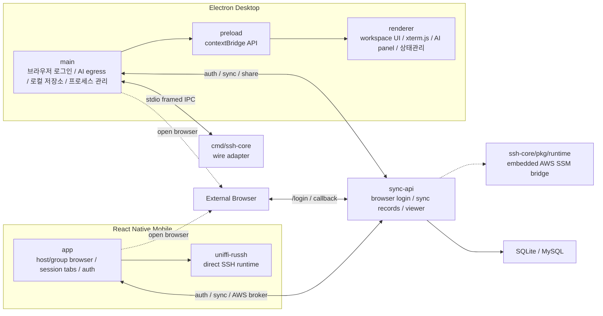
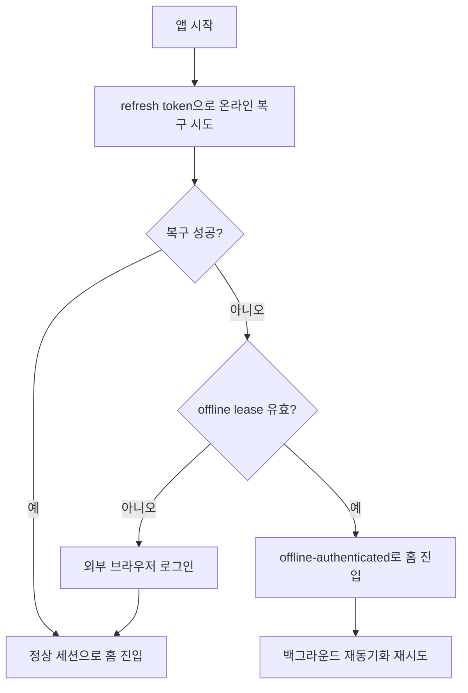

# Dolgate 아키텍처

Dolgate는 현재 네 개의 주요 런타임 경계로 나뉩니다.

1. Electron 기반 데스크톱 앱
2. React Native 기반 모바일 앱
3. SSH/SFTP/포트 포워딩 기능을 제공하는 Go `ssh-core`
4. 인증, 동기화, session share viewer, AWS SSM 브로커를 담당하는 Go `sync-api`

복잡한 사용자 흐름(인증/오프라인, Session Share, AWS Import, 호스트 내보내기/가져오기, Warpgate)은 아래 [주요 흐름](#주요-흐름)에 정리돼 있습니다.

```mermaid
flowchart LR
  subgraph Desktop["Electron Desktop"]
    Main["main<br/>브라우저 로그인 / AI egress / 로컬 저장소 / 프로세스 관리"]
    Preload["preload<br/>contextBridge API"]
    Renderer["renderer<br/>workspace UI / xterm.js / AI panel / 상태관리"]
    Main --> Preload --> Renderer
  end
  subgraph Mobile["React Native Mobile"]
    MobileApp["app<br/>host/group browser / session tabs / auth"]
    MobileSSH["uniffi-russh<br/>direct SSH runtime"]
    MobileApp --> MobileSSH
  end
  Main <-->|"stdio framed IPC"| CoreCmd["cmd/ssh-core<br/>wire adapter"]
  Main <-->|"auth / sync / share"| Sync["sync-api<br/>browser login / sync records / viewer"]
  MobileApp <-->|"auth / sync / AWS broker"| Sync
  Sync -.-> CoreLib["ssh-core/pkg/runtime<br/>embedded AWS SSM bridge"]
  Sync --> DB["SQLite / MySQL"]
  Browser["External Browser"] <-->|"/login / callback"| Sync
  Main -. "open browser" .-> Browser
  MobileApp -. "open browser" .-> Browser
```

## 데스크톱 앱

- `main`
  브라우저 윈도우, 로컬 파일 저장소, encrypted secret store, 브라우저 로그인, 서버 동기화, AI provider egress, Go 코어 프로세스 수명주기, GitHub Releases 기반 auto update를 관리합니다.
- `preload`
  `contextBridge`를 통해 renderer에 필요한 최소 API만 노출합니다.
- `renderer`
  Zustand 상태와 xterm.js 기반 탭 UI, 로그인 게이트, 호스트 목록, 검색 인터페이스, 고정 `SFTP` 워크스페이스, AI 패널과 터미널 scrollback snapshot을 담당합니다.

주요 런타임 특징:

- main이 앱 시작 시 로그인 복구, offline lease 기반 `offline-authenticated` 진입, 외부 브라우저 로그인 세션 교환을 담당합니다(상세 단계는 아래 [주요 흐름 > 인증과 오프라인](#인증과-오프라인)).
- AI 어시스턴트의 provider 호출과 웹/URL 도구는 Electron main에서 실행해 API 키와 외부 egress를 renderer 밖에 둡니다. renderer는 질문 시점의 터미널 snapshot과 사용자 인터페이스만 담당합니다.
- `ssh-core`는 앱 시작 시 항상 떠 있지 않고, 실제 SSH/SFTP/포트 포워딩 경로가 필요할 때 lazily 시작합니다.
- 로컬 파일 브라우징은 Electron main의 파일 서비스가 담당하고, 원격 SFTP 작업·파일 전송·인앱 파일 편집(읽기/쓰기)은 Go 코어가 담당합니다.

## 모바일 앱

- React Native 기반 iOS / Android 앱입니다.
- 동기화된 host / group / session 상태를 기반으로 현재 연결된 세션 탭 워크스페이스를 구성합니다.
- 하단 단축키 바와 모바일 터미널 입력 보조 UI로 터치 환경의 터미널 입력을 돕습니다.
- SSH 세션은 모바일 런타임에서 직접 처리하고, 인증/동기화/AWS SSM 브로커 경로는 `sync-api`와 통신합니다.
- 모바일은 데스크톱과 같은 저장소 버전을 따르지만, 별도 앱 런타임과 별도 build 체계를 가집니다(빌드·실행은 [build-and-deploy](./build-and-deploy.md) 참고).

## SSH 코어

- `services/ssh-core/pkg/runtime`이 공개 런타임 façade 역할을 합니다.
- 내부 구현은 여전히 `internal/awssession`, `internal/sshsession`, `internal/moshsession`, `internal/tmuxsession`, `internal/sftp`, `internal/containers`, `internal/forwarding`, `internal/ssmforward` 같은 세부 서비스에 남아 있습니다.
- 연결 유형은 서비스로 분리돼 있습니다 — `sshsession`(일반 SSH/PTY), `moshsession`(SSH 부트스트랩 후 UDP로 전환하는 mosh), `tmuxsession`(tmux control mode — 원격 윈도우/패인을 탭·분할로 매핑).
- Electron 데스크톱은 여전히 `cmd/ssh-core` child process를 띄워 사용합니다.
- `cmd/ssh-core`는 stdio framed protocol을 decode/encode하는 호환 어댑터이고, 실제 작업은 `pkg/runtime`에 위임합니다.
- `sync-api`는 AWS SSM WebSocket 브로커에서 `pkg/runtime`를 직접 import해서 고루틴 기반으로 세션을 처리합니다.
- control 명령은 metadata JSON frame으로, 터미널 입출력은 raw byte stream frame으로 주고받습니다.
- SSH 터미널 세션은 `sessionId`, SFTP endpoint는 `endpointId`, 전송 작업은 `jobId`로 구분합니다.
- 개발 모드에서 desktop는 `go run ./cmd/ssh-core`를 필요 시 실행하고, 서버는 `sync-api` 프로세스 안에 embedded runtime을 직접 구성합니다.

## Sync API

- 서버는 `/login` 브라우저 페이지와 인증 API, 그리고 암호화된 동기화 레코드 저장소를 함께 제공합니다.
- 인증은 local login + optional OIDC SSO를 동시에 지원할 수 있습니다.
- refresh token은 해시만 저장하며, 미사용 14일 만료와 rotation 정책을 사용합니다.
- 동기화 레코드는 `groups`, `hosts`, `secrets`, `known_hosts`, `port_forwards`, `preferences` 단위의 generic `sync_records` 구조에 저장합니다.
- secrets는 비밀번호, passphrase, 관리형 private key PEM까지 포함하지만 서버에는 ciphertext만 저장합니다.
- session share는 별도의 in-memory hub와 viewer asset으로 제공되며, 브라우저 viewer는 WebSocket으로 owner 세션을 구독합니다.
- 저장소 계층은 GORM으로 구현하고, SQLite와 MySQL을 모두 지원합니다.
- 모바일 AWS SSM 세션 브로커는 `sync-api` 안의 embedded `ssh-core/pkg/runtime`를 사용하며, 별도 `ssh-core` 바이너리를 실행하지 않습니다.

## 경계 요약

- 데스크톱은 `cmd/ssh-core` child process를 사용합니다.
- 모바일은 자체 모바일 런타임으로 SSH 세션을 처리하고, 서버와는 인증/동기화/AWS 경계에서 통신합니다.
- `sync-api`는 브라우저 로그인, 암호화된 동기화 저장소, session share, AWS SSM 브로커를 한 프로세스에서 담당합니다.
- `ssh-core/pkg/runtime`는 desktop과 server 양쪽에서 재사용되는 공용 코어 런타임입니다.

## 주요 흐름

최근 추가된 복잡한 사용자 흐름을 빠르게 이해하기 위한 요약입니다.

### 인증과 오프라인

```mermaid
flowchart TD
  Start["앱 시작"] --> Refresh["refresh token으로 온라인 복구 시도"]
  Refresh --> Online{"복구 성공?"}
  Online -->|예| Ready["정상 세션으로 홈 진입"]
  Online -->|아니오| Lease{"offline lease 유효?"}
  Lease -->|예| Offline["offline-authenticated로 홈 진입"]
  Offline --> Resync["백그라운드 재동기화 재시도"]
  Lease -->|아니오| Browser["외부 브라우저 로그인"]
  Browser --> Ready
```

- offline 상태에서는 기존 로컬 캐시와 설정을 사용하고, 백그라운드에서 재동기화를 재시도합니다.
- 로그인은 외부 브라우저에서 처리하며, 데스크톱은 loopback callback 또는 `dolgate://auth/callback` 식별자로 세션을 교환합니다.

### Session Share

#### owner

- 터미널 세션에서 share를 시작하면 viewer URL이 생성됩니다.
- owner는 읽기 전용 또는 입력 허용 모드를 전환할 수 있습니다.
- viewer가 채팅을 보내면 owner 데스크톱 우하단에 토스트가 쌓입니다.
- `채팅 기록` 버튼을 누르면 별도 창에서 최근 메시지를 실시간으로 볼 수 있습니다.

#### viewer

- 브라우저 viewer는 session share URL로 접속합니다.
- 터미널 화면과 채팅 패널을 함께 사용합니다.
- 채팅 패널은 기본적으로 접힌 상태로 시작하고, 열면 참여자끼리 실시간 채팅이 가능합니다.
- 세션이 종료되면 viewer 연결과 채팅 기록이 함께 정리됩니다.

### AWS Import + AWS SFTP

#### import

- AWS profile을 고르면 인증 상태를 확인합니다.
- profile에 기본 리전이 있으면 그 리전을 자동 선택하고 EC2 목록을 불러옵니다.
- 기본 리전이 없으면 리전 목록만 먼저 보여주고, 사용자가 고른 뒤에만 EC2 목록을 조회합니다.
- Linux 인스턴스는 `SSH 정보 확인`을 눌러 SSH username/port 추천값을 확인합니다.
- 자동 확인 결과는 수정 가능하고, 값을 비운 채로도 Host를 최종 등록할 수 있습니다.

#### SFTP

- AWS SFTP는 Linux 인스턴스만 지원합니다.
- 전제 조건:
  - SSM managed
  - sshd/SFTP enabled
  - EC2 Instance Connect 가능
  - AWS 프로필 인증 완료 (세션 연결은 내장 SSM 데이터 채널로 동작)
- 연결 시 진행 단계가 UI에 표시됩니다.
  - profile 확인
  - 브라우저 로그인 필요 시 로그인
  - SSM 확인
  - 인스턴스 메타데이터 확인
  - host key probe
  - ephemeral key 생성과 공개 키 전송
  - 실제 SFTP 연결
- 자동 추천값이 맞지 않으면 username/port를 다시 입력해 재시도할 수 있습니다.

### 호스트 내보내기 · 가져오기

- 호스트 목록에서 호스트나 그룹을 골라 내보내면, 연결에 필요한 항목(자격증명·점프 호스트 등)을 함께 담습니다.
- 형식은 암호로 암호화한 Dolgate 파일과 평문 OpenSSH config 중에 고릅니다. OpenSSH로 표현할 수 없는 호스트는 개수를 먼저 알려주고 제외합니다.

### Warpgate Import

- Warpgate import는 내부 브라우저 인증 창으로 로그인합니다.
- 중단 후에도 import 다이얼로그는 그대로 남아 URL 수정이나 재시도가 가능합니다.
- 로그인 성공 후 target 목록을 가져와 Host로 추가합니다.
