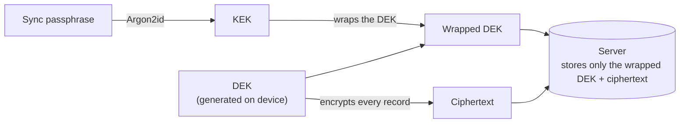

# Data Protection (E2EE Sync)

Dolgate encrypts **all synced data** on the device before upload. The decryption key can only be unlocked with the user's **sync passphrase**, and the server never stores the sync passphrase or the raw decryption key. As a result, **the server — including a self-hosting operator — cannot read the contents of synced data**.

The point of E2EE is not just encrypting the data, but **protecting the decryption key itself so the server can never learn it**. This page explains how keys are created and stored, and how recovery works.

## How it works

Two keys are involved, set up in two stages.

- **DEK** — the key that encrypts the actual data (AES-256-GCM). Generated on the device.
- **KEK** — a key derived from the sync passphrase with Argon2id. Used only to wrap the DEK. The sync passphrase and the KEK never leave the device.
- The server stores **only the wrapped DEK and ciphertext**. The wrapped DEK cannot be unwrapped without the correct sync passphrase.

## What the server knows / does not know

- **Does not know** — the contents of synced data (all of it is ciphertext), the sync passphrase, the raw decryption key.
- **Knows** — the account email, plus the sync metadata needed to operate (record counts, modification times, and so on). None of it includes content.

Under this design, whether you use the managed server or self-host, a database breach exposes only ciphertext and wrapped keys.

## Reset and recovery

If you forget the sync passphrase, the server cannot recover it for you (it holds no key). The last resort is a **reset**, available from the "Sync passphrase" section in Settings (while unlocked) or from the passphrase prompt after signing in. A reset proceeds in this order:

1. **All data synced to the server is deleted.** Data encrypted with the old key can no longer be decrypted, so it is removed from the server entirely.
2. **A new sync passphrase and a new key (DEK) are created.**
3. **The local data on the device that ran the reset is encrypted with the new key and uploaded fresh.** Local data is not locked behind the sync passphrase (the passphrase only protects what goes to the server), so it can be re-encrypted and uploaded without the old passphrase. A reset deletes server data only — it never touches the device's local data.

Afterwards, other devices detect the generation change on the server and switch to the lock screen (the server rejects pushes made with the old key). Entering the new sync passphrase lets them rejoin.

> **Caution — recovery only works from a device that still has local data.** Run the reset on the device you normally use, the one that holds your data. **Signing out deletes this device's sync data, including keychain secrets**, so if you have forgotten the passphrase and sign out first, there is no local data left to recover from. If you reset from a fresh device with no data, a device that does have data will re-upload it the next time it syncs, after the new passphrase is entered there.

## Host file export

Separately from sync, the desktop app can export selected hosts to a file. This is **the only path where credentials leave the device as a file**, so handle it with care.

- **Dolgate file (`.dolgate`)** — contains groups, hosts, credentials, known hosts, port forwarding rules, DNS overrides, AWS profiles and snippets, with the entire file **encrypted with an export passphrase**. It uses the same scheme as the sync vault (Argon2id key derivation + AES-256-GCM), and the passphrase is stored nowhere in the file. **If you forget the passphrase, the file cannot be opened and there is no way to recover it.** Keep the file and its passphrase in separate places.
- **OpenSSH config** — a **plaintext** config for use with other tools. **It contains no credentials**, but connection details such as host addresses and usernames are exposed as-is, so treat it like any other configuration file.

The export passphrase is **independent** of the sync passphrase. Changing one does not affect the other, and an already-exported file opens only with the passphrase used at export time (it cannot be invalidated after the fact — if you suspect a leak, destroy the file and rotate the credentials).

## Cryptography

KEK derivation from the sync passphrase uses Argon2id; the DEK and record encryption use AES-256-GCM — all widely reviewed standard algorithms, with no home-grown cryptography. The exact parameters live in the implementation ([`packages/shared-core/src/vault.ts`](../packages/shared-core/src/vault.ts)).
