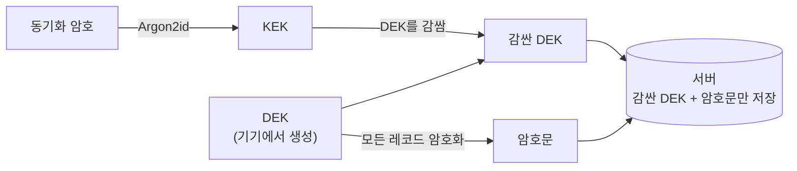

# 데이터 보호 (E2EE 동기화)

동기화 암호 설정 또는 기존 계정의 E2EE 전환을 완료하면, Dolgate는 동기화되는 **모든 데이터**를 기기에서 암호화한 뒤 서버로 올립니다. 복호화 키는 사용자의 **동기화 암호**로만 풀리고, 서버는 그 암호도 복호화 키 원문도 갖지 않습니다. 따라서 **E2EE가 활성화된 계정에서는 서버(자체 호스팅 운영자 포함)가 동기화된 데이터의 내용을 알 수 없습니다**.

구버전 클라이언트·구버전 자체 호스팅 서버와 호환되는 레거시(v1) 동기화는 서버가 원문 DEK를 보관합니다. 지원되는 클라이언트와 서버에서 동기화 암호 설정 또는 E2EE 전환을 마친 뒤부터 아래 보호가 적용됩니다.

## 동작 방식

동기화 암호에서 두 단계로 키가 만들어집니다.

- **DEK** — 실제 데이터를 암호화하는 키(AES-256-GCM). 기기에서 생성됩니다.
- **KEK** — 동기화 암호에서 Argon2id로 유도한 키. DEK를 감싸는 데만 씁니다. 동기화 암호와 KEK는 기기를 떠나지 않습니다.
- 서버에는 **감싼 DEK와 암호문만** 저장됩니다. 감싼 DEK는 올바른 동기화 암호 없이는 풀리지 않습니다.

## 서버가 아는 것 / 모르는 것

- **모름** — 동기화되는 데이터의 내용(전부 암호문), 동기화 암호, 복호화 키 원문.
- **앎** — 계정 이메일, 그리고 운영에 필요한 동기화 메타데이터(레코드 개수·변경 시각 등). 내용은 포함되지 않습니다.

E2EE가 활성화된 뒤에는 관리형 서버든 자체 호스팅이든, DB가 유출되더라도 암호문과 감싼 키만 노출됩니다.

## 초기화와 복구

동기화 암호를 잊으면 서버는 복구해 줄 수 없습니다(키를 갖지 않으므로). 이때 최후 수단이 **초기화**이며, 설정의 "동기화 암호" 섹션(잠금 해제 상태) 또는 로그인 후 암호 입력 화면에서 실행할 수 있습니다. 실행하면 다음 순서로 진행됩니다.

1. **서버에 동기화돼 있던 데이터가 전부 삭제됩니다.** 옛 키로 암호화돼 더 이상 풀 수 없는 데이터를 서버에서 완전히 지웁니다.
2. **새 동기화 암호와 새 키(DEK)를 만듭니다.**
3. **초기화를 실행한 기기의 로컬 데이터가 그 새 키로 암호화되어 서버에 새로 업로드됩니다.** 로컬 데이터는 동기화 암호로 잠겨 있지 않으므로(암호는 서버에 올라가는 데이터만 보호합니다) 옛 암호 없이도 새 키로 암호화해 올릴 수 있습니다. 초기화는 서버 데이터만 지우고 기기 로컬 데이터는 건드리지 않습니다.

이후 다른 기기는 서버의 세대 변경을 감지해 잠금 화면으로 전환하고(옛 키로는 서버가 push를 거부합니다), 새 동기화 암호를 입력하면 다시 합류합니다.

> **주의 — 복구는 로컬 데이터가 있는 기기에서만 됩니다.** 초기화는 데이터를 가진 기기(평소 쓰던 기기)에서 실행하세요. **로그아웃은 이 기기의 동기화 데이터(키체인 시크릿 포함)를 지우므로**, 암호를 잊은 상태에서 로그아웃부터 하면 복구할 로컬 데이터가 사라집니다. 데이터가 없는 새 기기에서 초기화한 경우에는, 데이터를 가진 다른 기기가 다음 동기화에서 새 암호를 입력할 때 다시 업로드됩니다.

## 암호화 방식

동기화 암호에서 KEK를 유도할 때는 Argon2id, DEK와 레코드 암호화에는 AES-256-GCM을 씁니다 — 모두 널리 검증된 표준 알고리즘이며 자체 고안한 암호는 쓰지 않습니다. 구체적인 파라미터는 구현([`packages/shared-core/src/vault.ts`](../packages/shared-core/src/vault.ts))에 있습니다.
