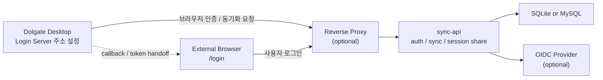

# sync-api 자체 호스팅 가이드

Dolgate의 브라우저 로그인과 데이터 동기화를 직접 운영하려면 `sync-api`를 별도 서버에 띄우면 됩니다.
이 문서는 가장 단순한 SQLite 단일 인스턴스 배포부터 MySQL, OIDC, 운영 시 주의사항까지 한 번에 정리한 가이드입니다.

## 개요

- 데스크톱 앱과 `sync-api`는 별도 프로세스입니다.
- 데스크톱 앱은 로그인 화면의 `Login Server`에 설정된 주소로 브라우저 인증과 동기화를 요청합니다.
- 가장 쉬운 시작점은 Docker Compose + SQLite 단일 인스턴스입니다.
- 운영 환경에서는 `latest` 대신 명시 버전 태그를 고정하는 것을 권장합니다.



## 가장 빠른 시작: SQLite 단일 인스턴스

기본 예제 파일:

- [docker-compose.example.yml](../services/sync-api/deploy/docker-compose.example.yml)

실행 순서:

```bash
cd services/sync-api/deploy
cp docker-compose.example.yml docker-compose.yml
docker compose up -d
docker compose ps
curl http://127.0.0.1:8080/healthz
```

예제 compose는 아래와 같습니다.

```yaml
services:
  sync-api:
    image: ghcr.io/doldolma/dolgate-sync-api:latest
    container_name: dolgate-sync-api
    restart: unless-stopped
    ports:
      - "8080:8080"
    volumes:
      - dolgate-sync-api-data:/app/data

volumes:
  dolgate-sync-api-data:
```

이 구성의 의미:

- 기본 포트는 `8080`입니다.
- SQLite DB 파일은 `/app/data/dolgate_sync.db`에 저장됩니다.
- 인증 서명 키는 기본적으로 `/app/data/auth-signing-private.pem`을 사용합니다.
- 첫 부팅 시 해당 키 파일이 없으면 `sync-api`가 새 RSA private key를 생성해서 저장합니다.
- 같은 volume을 유지하면 기존 refresh token, browser login state, offline lease 검증이 계속 유지됩니다.
- volume을 잃으면 기존 세션과 토큰은 모두 무효화되며 재로그인이 필요합니다.

## 데스크톱 앱 연결

서버가 뜨면 데스크톱 앱에서 다음 순서로 연결합니다.

1. 로그인 화면에서 톱니바퀴를 엽니다.
2. `Login Server`를 self-host 주소로 바꿉니다.
3. 저장 후 로그인/동기화를 진행합니다.

예:

- 로컬 테스트: `http://127.0.0.1:8080`
- reverse proxy 뒤 운영: `https://ssh.example.com`


## 운영 기본값과 권장 설정

### 이미지 태그

- 예제는 빠른 시작용으로 `latest`를 사용합니다.
- 운영에서는 버전 태그 pinning을 권장합니다.

예:

```yaml
image: ghcr.io/doldolma/dolgate-sync-api:X.Y.Z
```

업데이트 절차:

```bash
docker compose pull
docker compose up -d
```

### 백업 대상

SQLite 단일 인스턴스 기준으로는 `/app/data` 전체를 백업하면 됩니다.

중요 파일:

- `dolgate_sync.db`
- `auth-signing-private.pem`

### HTTPS / reverse proxy

- 운영 배포는 HTTPS reverse proxy 뒤에 두는 것을 전제로 하는 편이 안전합니다.
- reverse proxy를 쓴다면 `TRUSTED_PROXIES`에 실제 프록시 주소만 넣어야 합니다.
- `TRUSTED_PROXIES`를 비워 두면 `X-Forwarded-For`를 신뢰하지 않습니다.

예:

```yaml
environment:
  TRUSTED_PROXIES: "172.17.0.1,10.0.0.0/8"
```

현재 repo에는 nginx 예제 파일이 포함되어 있지 않으므로, 사용하는 프록시에 맞춰 `Host`, `X-Forwarded-For`, `X-Forwarded-Proto` 전달만 맞추면 됩니다.

## MySQL로 전환할 때

기본 MySQL 예제 파일:

- [docker-compose.mysql.example.yml](../services/sync-api/deploy/docker-compose.mysql.example.yml)

실행 순서:

```bash
cd services/sync-api/deploy
cp docker-compose.mysql.example.yml docker-compose.yml
docker compose up -d
docker compose ps
curl http://127.0.0.1:8080/healthz
```

이 예제는 다음을 추가합니다.

- MySQL 8.4 컨테이너
- `DB_DRIVER=mysql`
- `DATABASE_URL=...@tcp(mysql:3306)/...`

주의사항:

- `mysql:3306`은 Docker Compose 내부 서비스명일 때만 동작합니다.
- 비밀번호는 예제의 `CHANGE_ME_*` 값을 그대로 쓰면 안 됩니다.
- `sync-api` 컨테이너에서도 `/app/data` volume은 유지하는 편이 안전합니다.
  - DB를 MySQL로 옮겨도 signing key는 계속 필요합니다.

## Google OIDC + MySQL

예제 파일:

- [docker-compose.oidc-mysql.example.yml](../services/sync-api/deploy/docker-compose.oidc-mysql.example.yml)

이 예제는 다음 환경을 전제로 합니다.

- MySQL 사용
- 로컬 로그인 비활성화
- 로컬 회원가입 비활성화
- Google OIDC 사용

핵심 환경 변수:

```yaml
environment:
  DB_DRIVER: mysql
  DATABASE_URL: dolgate_user:CHANGE_ME_PASSWORD@tcp(172.17.0.1:3309)/dolgate?charset=utf8mb4&parseTime=True&loc=UTC
  LOCAL_AUTH_ENABLED: "false"
  LOCAL_SIGNUP_ENABLED: "false"
  OIDC_ENABLED: "true"
  OIDC_DISPLAY_NAME: "Google"
  OIDC_ISSUER_URL: "https://accounts.google.com"
  OIDC_CLIENT_ID: "CHANGE_ME_CLIENT_ID"
  OIDC_CLIENT_SECRET: "CHANGE_ME_CLIENT_SECRET"
  OIDC_REDIRECT_URL: "https://ssh.example.com/auth/oidc/callback"
  OIDC_SCOPES: "openid,profile,email"
  TRUSTED_PROXIES: "172.17.0.1"
```

OIDC에서 특히 중요한 값:

- `OIDC_ISSUER_URL`
- `OIDC_CLIENT_ID`
- `OIDC_CLIENT_SECRET`
- `OIDC_REDIRECT_URL`
- `OIDC_SCOPES`

`OIDC_REDIRECT_URL`은 실제 외부에서 접근하는 주소와 정확히 일치해야 합니다.

## 자주 쓰는 환경 변수

`sync-api`는 config file 없이 env-only로 운영할 수 있습니다.

주요 변수:

```text
PORT
DB_DRIVER
DATABASE_URL
TRUSTED_PROXIES
AUTH_SIGNING_PRIVATE_KEY_PEM
AUTH_SIGNING_PRIVATE_KEY_PATH
ACCESS_TOKEN_TTL_MINUTES
REFRESH_TOKEN_IDLE_DAYS
OFFLINE_LEASE_TTL_HOURS
REFRESH_ROTATION_HANDOFF_SECONDS
LOCAL_AUTH_ENABLED
LOCAL_SIGNUP_ENABLED
OIDC_ENABLED
OIDC_DISPLAY_NAME
OIDC_ISSUER_URL
OIDC_CLIENT_ID
OIDC_CLIENT_SECRET
OIDC_REDIRECT_URL
OIDC_SCOPES
```

기본값 메모:

- `PORT`: `8080`
- `DB_DRIVER`: `sqlite`
- `DATABASE_URL`: `file:./data/dolgate_sync.db?_pragma=busy_timeout(5000)`
- `AUTH_SIGNING_PRIVATE_KEY_PATH`: `./data/auth-signing-private.pem`
- `LOCAL_AUTH_ENABLED`: `true`
- `LOCAL_SIGNUP_ENABLED`: `true`
- `OIDC_ENABLED`: `false`

## 서명 키 관련 주의사항

`sync-api`는 access token, browser login state, offline lease를 모두 같은 RS256 signing keypair로 서명합니다.

운영 팁:

- 단일 인스턴스면 `/app/data/auth-signing-private.pem` 자동 생성만으로도 충분합니다.
- 멀티 인스턴스 운영이나 키 교체 정책이 필요하면 직접 PEM을 주입해야 합니다.
- 운영자가 별도 PEM을 주입하면 자동 생성보다 그 값을 우선 사용합니다.

지원 방식:

- `AUTH_SIGNING_PRIVATE_KEY_PEM`
- `AUTH_SIGNING_PRIVATE_KEY_PATH`

더 이상 지원하지 않는 legacy 값:

- `JWT_SECRET`
- `OFFLINE_LEASE_SIGNING_PRIVATE_KEY_PEM`

## 문제 생길 때 먼저 볼 것

### healthz는 되는데 앱 로그인이 안 될 때

- 데스크톱 앱의 `Login Server` 주소가 self-host 주소와 정확히 일치하는지 확인합니다.
- reverse proxy를 쓴다면 외부 URL과 `OIDC_REDIRECT_URL`이 같은지 확인합니다.
- `TRUSTED_PROXIES`가 실제 프록시 주소와 맞는지 확인합니다.

### 재시작 후 전부 로그아웃될 때

- `/app/data` volume이 유지되고 있는지 확인합니다.
- `auth-signing-private.pem`이 바뀌지 않았는지 확인합니다.

### MySQL 연결이 안 될 때

- `DB_DRIVER=mysql`이 설정되어 있는지 확인합니다.
- `DATABASE_URL`의 host/port/user/password/dbname이 실제 DB와 맞는지 확인합니다.
- Compose 내부 연결이면 `mysql:3306`, 외부 DB면 실제 IP/도메인을 써야 합니다.

### OIDC 로그인 후 callback이 실패할 때

- `OIDC_REDIRECT_URL`이 provider에 등록된 redirect URI와 정확히 일치하는지 확인합니다.
- 외부 접속 주소가 `https://ssh.example.com`인데 내부 `http://sync-api:8080` 값을 넣지 않았는지 확인합니다.

## 수동 검증 체크리스트

- `curl http://127.0.0.1:8080/healthz`가 성공하는지
- 데스크톱 앱에서 브라우저 로그인과 세션 교환이 정상 동작하는지
- 로그인 후 동기화가 정상적으로 동작하는지
- 서버 재시작 후에도 기존 로그인 상태가 유지되는지
- MySQL/OIDC 환경이라면 로컬 로그인 비활성화와 OIDC 로그인만 노출되는지

## 관련 문서

- [빌드 및 배포](./build-and-deploy.md)
- [아키텍처](./architecture.md)
