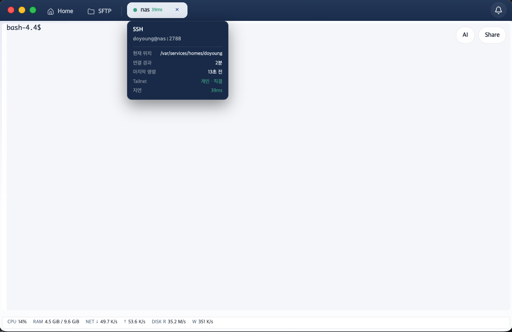

# Tailscale / Headscale Guide

Dolgate embeds a tailnet node inside the app, so it reaches hosts inside a tailnet **without installing Tailscale or granting VPN permissions**. The OS routing and DNS are untouched. Register several tailnets (work, customer, home) side by side and choose per host which one to go through — it is not a system VPN, so you can be on **several networks at the same time**.

Both the default Tailscale server and self-hosted control planes like Headscale are supported, registered the same way.

## Registering a network

Add a network under Settings > **Tailscale**.

1. **Name** — what this tailnet is called inside the app.
2. **Server address** — empty for the default Tailscale server; for a self-hosted control plane like Headscale, its address.
3. **Auth key** — with one, registration happens without a browser. Leave it empty and a browser opens automatically as soon as the auth link is ready.
4. The network is saved once the **connection test** passes. After joining, it also shows which account joined which tailnet.

### Auth key vs. browser login

- **Auth key** — registers with no human in the loop. Nodes registered this way are cleaned up automatically by the control plane when unused (ephemeral).
- **Browser login** — authorize on the control plane's login screen (including OIDC). Nodes registered this way persist.
- Headscale has a known issue where the OIDC login path ignores the ephemeral flag ([headscale#2719](https://github.com/juanfont/headscale/issues/2719)), so that combination leaves a persistent node.

## Assigning a tailnet to a host

Choose one in the **Tailnet** selector in the host create/edit window's Connection section. The *Manage* link next to it jumps straight to the Tailscale section in Settings.

- Hosts without a tailnet connect directly over the regular network, as usual. They can be mixed in one list.
- Addresses can be **MagicDNS short names, FQDNs, or tailnet IPs**.

## What travels through the tailnet

Assign a tailnet to a host and **everything** headed for that host goes through the node — shell, tmux, mosh, SFTP, containers, port forwarding — and **host key verification too**. mosh routes not just the bootstrap SSH but the UDP session as well, so no firewall UDP port needs opening.

## Node lifecycle

- You do not have to pre-connect in Settings — the node comes up when you connect to a host. So **only the first connection takes a few seconds**; after that it is instant. Tailnets that require browser login must be authenticated in Settings first.
- **One node per tailnet**, shared. Nodes are not created per host, so the admin console's device list does not grow with your host count.
- The node stays up briefly after the last connection ends — 30 minutes on desktop, shorter on mobile to save battery. Reconnecting to the same tailnet is common, and this avoids redoing the handshake and path discovery.

## Understanding connection states

While the node comes up, progress is shown on the connection screen.

| State | Meaning |
|---|---|
| Needs auth (needsAuth) | authorization in the browser is required. The auth link is shown alongside |
| Awaiting approval (needsApproval) | registered, waiting for an admin to approve the device |
| Starting (starting) | the node is coming up |
| Running (running) | done — the connection proceeds |
| Stopped (stopped) | stopped, with the reason shown |

### When sync is lost

Even if synchronization with the control plane (map poll) drops, **connections are still attempted**. Existing routes keep working from the already-received device list — what broke is the update channel (Tailscale itself does not warn about this state for 8 minutes). A warning remains on the *control plane sync* step of the connection screen, shown as **sync lost** in Settings. If the host truly cannot be reached, the reason appears at the next steps (routing/SSH).

## Security rules

- **Host key trust is per-tailnet.** A trusted key is valid only within that tailnet — the same name on a different tailnet is a different machine.
- **No connecting while joined to the wrong tailnet.** Right before connecting, the tailnet actually joined is compared against the one stored in settings; if they differ (for example, signed in with a different account), the connection is refused.
- **No fallback to the public network.** Hosts pointing at a tailnet that was deleted in Settings are refused — otherwise a connection meant for a private network would silently leave it.

## Paths and performance

- Hover over a tab to see the tailnet name and the current path (**direct** or **via relay + DERP region**) with latency. Starting on a relay right after connecting and switching to direct shortly after is normal.

- It uses an in-app network stack, so bulk-transfer throughput is lower than with the OS client. Latency is dominated by the path — once a direct connection is established, the difference is barely noticeable.

## Per-device registration and sync

Tailnets are registered **per device**. Settings and auth keys sync encrypted (the server sees only ciphertext), but a device's node key never syncs — otherwise two devices would impersonate the same node. In device lists the app appears as `dolgate-<device name>`.

Mobile (iOS/Android) connects the same way, inside the app. Networks registered on desktop sync over, so on the phone you just tap the host (tailnets that use browser login still need a one-time authentication there).

## Constraints

- Cannot be combined with AWS EC2's server proxy — both take over the connection to the target.
- Deregistering a node (deleting the network in Settings) removes it from the control plane and deletes local state. Recreating the tailnet configuration goes through the same flow as first registration.
